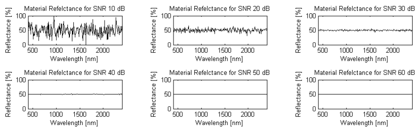

# MATLAB Hyperspectral Toolbox

A comprehensive MATLAB toolbox for hyperspectral image processing and analysis, providing state-of-the-art exploitation algorithms for research and educational purposes.

## Overview

This toolbox was originally developed to support research for my Master's thesis "[An Evaluation of Three Endmember Extraction Algorithms: ATGP, ICA-EEA, and VCA](https://etda.libraries.psu.edu/catalog/8265)" under the advisorship of Dr. Tim Kane at Penn State's Remote Sensing and Space Systems Lab. The work has since evolved into a broader collection of hyperspectral analysis tools that continues to serve the remote sensing research community.

## Key Capabilities & Examples

### Noise Handling and Signal Quality

*Demonstration of how different SNR levels affect spectral signatures, from 10dB (high noise) to 60dB (low noise). This understanding is crucial for processing real sensor data.*

### Material Classification

*Example of material classification results from hyperspectral analysis*

### Material Abundance Mapping




*Progressive examples of material abundance mapping showing different material concentrations overlaid on Google Earth imagery of Moffett Field, CA. These maps demonstrate the toolbox's ability to identify and quantify material distributions across a scene.*

## Features

The toolbox includes implementations of various hyperspectral exploitation algorithms:

### Core Capabilities
- Target Detection Algorithms
  - RX Detector
  - Matched Filter
  - ACE (Adaptive Cosine Estimator)
  - Various hybrid detectors
- Material Abundance Mapping
  - FCLS (Fully Constrained Least Squares)
  - UCLS (Unconstrained Least Squares)
  - NNLS (Non-Negative Least Squares)
- Spectral Unmixing
  - VCA (Vertex Component Analysis)
  - ICA-EEA (Independent Component Analysis - Endmember Extraction Algorithm)
  - ATGP (Automated Target Generation Process)
- Data Processing
  - MNF (Minimum Noise Fraction)
  - PCA (Principal Component Analysis)
  - Spectral Angle Mapper (SAM)
  - Spectral Information Divergence (SID)
- Visualization Tools
  - 2D/3D data conversion
  - Colormap generation
  - Advanced plotting functions

### File Support
- AVIRIS (.rfl) reading
- ASD FieldSpec file reading
- ENVI signature import
- SPECPR file format support
- Various hyperspectral data format conversions

## Dependencies

- MATLAB (version requirements TBD)
- [FastICA Toolbox](https://research.ics.aalto.fi/ica/fastica/) - Required for certain unmixing functions
  - Add to MATLAB's path using `addpath('path_to_fastica')`

## Installation

1. Clone the repository:
```bash
git clone https://github.com/isaacgerg/matlabHyperspectralToolbox.git
```

2. Add the toolbox to your MATLAB path:
```matlab
addpath('path_to_toolbox')
```

3. Install FastICA if needed for unmixing functionality

## Usage

The toolbox includes several demo scripts to help you get started:
- `hyperDemo.m` - General toolbox functionality
- `hyperDemo_detectors.m` - Target detection algorithms
- `hyperDemo_RIT_data.m` - Working with RIT dataset
- `hyperDemo_ASD_reader.m` - Reading ASD FieldSpec data

## Function Documentation

### Target Detection Algorithms

#### hyperAce.m (Adaptive Cosine/Coherence Estimator)
Implements the ACE detector which normalizes the matched filter by both the background clutter energy and target energy:
```
ACE(x) = (s^T Σ^(-1) x)^2 / ((s^T Σ^(-1) s)(x^T Σ^(-1) x))
```
where s is the target signature, x is the test pixel, and Σ is the background covariance matrix.

#### hyperAmsd.m (Adaptive Matched Subspace Detector)
Implements a GLRT detector for signals in subspace interference:
```
AMSD = (x^T P_B⊥ x - x^T P_(B,S)⊥ x) / (x^T P_(B,S)⊥ x)
```
where P_B⊥ is the projection onto the orthogonal complement of the background subspace.

#### hyperAtgp.m (Automated Target Generation Process)
Implements an orthogonal projection-based endmember extraction:
1. Finds pixel with largest magnitude
2. Projects data onto space orthogonal to found pixel
3. Repeats until desired number of endmembers found

#### hyperGlrt.m (Generalized Likelihood Ratio Test)
Implements the GLRT detector:
```
GLRT(x) = (s^T Σ^(-1) x)^2 / (s^T Σ^(-1) s)
```
Similar to ACE but without normalization by the pixel energy.

### Dimensionality Reduction & Whitening

#### hyperMnf.m (Minimum Noise Fraction)
Implements noise-adjusted principal components:
1. Estimates noise covariance Σn
2. Whitens data using noise covariance
3. Performs PCA on whitened data
```
MNF = eig(Σn^(-1/2) Σ Σn^(-1/2))
```

#### hyperNapc.m (Noise-Adjusted Principal Components)
Similar to MNF but uses a different noise estimation approach.

#### hyperWhiten.m 
Implements data whitening:
```
x_white = Σ^(-1/2) x
```
where Σ^(-1/2) is computed via eigendecomposition.

### Spectral Unmixing

#### hyperFcls.m (Fully Constrained Least Squares)
Solves the constrained optimization problem:
```
min ||Ax - b||^2 subject to sum(x) = 1 and x ≥ 0
```
where A contains endmember signatures and x contains abundances.

#### hyperNnls.m (Non-Negative Least Squares)
Solves:
```
min ||Ax - b||^2 subject to x ≥ 0
```

#### hyperUcls.m (Unconstrained Least Squares)
Solves the basic least squares problem:
```
min ||Ax - b||^2
```

#### hyperVca.m (Vertex Component Analysis)
Implements VCA endmember extraction by:
1. Projecting data onto random vector
2. Finding extreme projections
3. Iterating with orthogonal projections

### Similarity Measures

#### hyperCorr.m
Computes Pearson correlation coefficient:
```
ρ = cov(x,y) / (σx σy)
```

#### hyperNormXCorr.m (Normalized Cross Correlation)
Computes normalized cross correlation:
```
NCC = (x^T y) / (||x|| ||y||)
```

#### hyperSam.m (Spectral Angle Mapper)
Computes spectral angle:
```
θ = arccos((x^T y) / (||x|| ||y||))
```

#### hyperSid.m (Spectral Information Divergence)
Computes information theoretic measure of spectral similarity using relative entropy.

### Statistical Detection

#### hyperHud.m (Hybrid Unstructured Detector)
Combines structured (matched filter) and unstructured (RX) detectors:
```
HUD = αRX + (1-α)MF
```

#### hyperRxDetector.m (Reed-Xiaoli Detector)
Implements anomaly detection:
```
RX(x) = (x-μ)^T Σ^(-1) (x-μ)
```
where μ is the mean and Σ is the covariance.

### Preprocessing

#### hyperConvexHullRemoval.m
Removes pixels inside the convex hull of selected vertices.

#### hyperDestreak.m
Removes vertical striping artifacts in push-broom sensors.

#### hyperNormalize.m
Normalizes spectra to unit length:
```
x_norm = x / ||x||
```

#### hyperResample.m
Resamples spectra to new wavelength positions using interpolation.

### Independent Component Analysis

#### hyperIcaEea.m (ICA Endmember Extraction)
Uses FastICA to find statistically independent endmembers:
1. Reduces dimensionality via PCA
2. Applies ICA to find independent components
3. Projects back to original space

#### hyperIcaComponentScores.m
Computes abundance maps from ICA components.

### File I/O

#### hyperReadAsd.m
Reads ASD FieldSpec spectrometer files.

#### hyperReadAvirisRfl.m
Reads AVIRIS reflectance data.

#### hyperReadSpecpr.m
Reads SPECPR format spectral library files.

#### hyperGetEnviSignature.m
Reads spectral signatures from ENVI spectral libraries.

### Visualization

#### hyperConvert2Colormap.m
Converts hyperspectral image to RGB using dimensionality reduction.

#### hyperConvert2d.m / hyperConvert3d.m
Converts between 2D (samples × bands) and 3D (rows × cols × bands) formats.

#### hyperImagesc.m / hyperImshow.m
Enhanced visualization of hyperspectral data cubes.

#### hyperMax2d.m
Finds local maxima in 2D arrays.

### Performance Evaluation

#### hyperPpi.m (Pixel Purity Index)
Computes measure of pixel spectral purity through repeated projections.

#### hyperRoc.m (Receiver Operating Characteristic)
Computes ROC curves for detector performance evaluation.

## Related Projects

Thanks to the permissive license of this toolbox, several derivative works have emerged:

### PySPTools
Much of this codebase has been ported to Python in the [PySPTools project](https://pysptools.sourceforge.io/), providing these algorithms to the Python community.

### HyperSpectral Toolbox by David Kun
[David Kun's fork](https://davidkun.github.io/HyperSpectralToolbox/) of this toolbox maintains the MATLAB implementation while adding several new features.

## Planned Features

Future development priorities include:
- Joint Affine Matched Filter
- Enhanced Matched Filter with signature statistics
- RAF-SAM (Improved Spectral Angle Mapper)
- ELM (Empirical Line Method) for radiance-to-reflectance conversion
- Advanced covariance matrix inversion methods
- Quadratic Detector
- Additional unmixing algorithms (SMACC, AMEE, NFINDR)
- Antonia Plaza's FastPPI
- Joshua Broaderwater's hybrid detectors

## Citation

If you use this toolbox in your research, please cite:

```bibtex
@Misc{matlab_hsi_toolbox,
    author    = {Isaac Gerg},
    title     = {Open Source MATLAB Hyperspectral Toolbox},
    howpublished = {\url{https://github.com/isaacgerg/matlabHyperspectralToolbox}},
    year      = {2006--2022}
}
```

## Contributing

Derivative works must include the original citation. New contributors should add their names to the author line while maintaining the original author information.

## Contact

Email: isaac.gerg@gergltd.com
